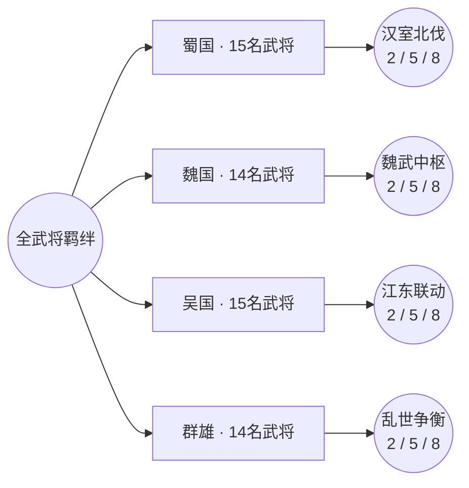

# 三国武将羁绊关系图

本目录按阵营整理当前代码中已经登记的武将羁绊。图中圆形节点表示羁绊，矩形节点表示武将，连接线表示该武将是该羁绊的成员。关系以图鉴登记为主，效果说明以实际战斗逻辑为准。

游戏内查看路径：主菜单 → 图鉴 → 羁绊图。可切换蜀、魏、吴、群；默认展示完整网状关系，点击武将或羁绊节点可聚焦一层直接关系并查看完整效果，同时支持缩放、平移、拖动节点和重置布局。

- [蜀国武将羁绊关系图](shu-bonds.md)
- [魏国武将羁绊关系图](wei-bonds.md)
- [吴国武将羁绊关系图](wu-bonds.md)
- [群雄武将羁绊关系图](qun-bonds.md)

数据来源：

- `ThreeKingdom/systems/game_ui.gd`：图鉴羁绊名称、成员和说明。
- `ThreeKingdom/systems/combat_system.gd`：实际战斗羁绊逻辑。
- `ThreeKingdom/systems/game_state.gd`：武将所属阵营与基础名单。
