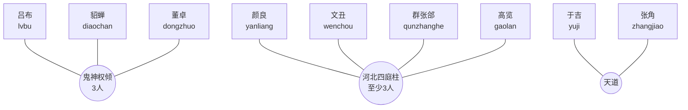

# 群雄武将羁绊关系图

全体群雄武将默认属于阵营羁绊“乱世争衡（2/5/8）”。高顺、陈宫、华佗、袁绍、袁术当前只有阵营羁绊，没有独立组合羁绊。

## 羁绊效果速查

| 羁绊 | 成员 | 当前效果 |
|---|---|---|
| 乱世争衡 | 任意2/5/8名群将 | 全体群雄武将技能冷却缩短3%/8%/15%；8人时，每次释放技能有20%概率连续释放两次。 |
| 鬼神权倾 | 吕布、貂蝉、董卓 | 吕布释放无双横扫后获得4秒致死保护；貂蝉魅惑延长至2.25秒；董卓当前生命追加比例提高至12%，开场获得2秒致死保护。 |
| 河北四庭柱 | 颜良、文丑、群张郃、高览，至少3人 | 全员开场获得紫幕；文丑额外获得35%概率反弹60%指向技能伤害；群张郃可为同列友军补充紫幕。 |
| 天道 | 于吉、张角 | 友军阵亡时有65%概率对随机敌人降下60%技能强度天雷。 |

## 仅有阵营羁绊的武将

高顺（`gaoshun`）、陈宫（`chengong`）、华佗（`huatuo`）、袁绍（`yuanshao`）、袁术（`yuanshu`）。
