# 蜀国武将羁绊关系图

全体蜀国武将默认属于阵营羁绊“汉室北伐（2/5/8）”，为避免连线遮挡，阵营羁绊没有逐个连接到图中的15名武将。

```mermaid
flowchart TB
    LB["刘备<br/>liubei"]
    GY["关羽<br/>guanyu"]
    ZF["张飞<br/>zhangfei"]
    ZY["赵云<br/>zhaoyun"]
    HZ["黄忠<br/>huangzhong"]
    MC["马超<br/>machao"]
    LS["刘禅<br/>liushan"]
    ZGL["诸葛亮<br/>zhugeliang"]
    JW["姜维<br/>jiangwei"]
    PT["庞统<br/>pangtong"]
    MH["孟获<br/>menghuo"]
    ZR["祝融<br/>zhurong"]
    DD["带来洞主<br/>dailaidongzhu"]
    WY["魏延<br/>weiyan"]
    MD["马岱<br/>madai"]

    TAOYUAN(("桃园结义<br/>3人"))
    TIGERS(("五虎上将<br/>5人"))
    DREAM(("夜梦北斗"))
    WOLONG_HAN(("卧龙辅汉"))
    SEVEN(("七进七出"))
    RIDER(("一骑当千"))
    FATED(("宿命之敌"))
    METEOR(("飞火流星"))
    DRAGON_PHOENIX(("卧龙凤雏"))
    LEGACY(("北伐传承"))
    CAPTURES(("七擒孟获"))
    COUPLE(("南蛮夫妇"))
    REINFORCE(("蛮王援军"))
    SIBLING(("姐弟同心"))

    LB --- TAOYUAN
    GY --- TAOYUAN
    ZF --- TAOYUAN

    GY --- TIGERS
    ZF --- TIGERS
    ZY --- TIGERS
    HZ --- TIGERS
    MC --- TIGERS

    LB --- DREAM
    LS --- DREAM
    LB --- WOLONG_HAN
    ZGL --- WOLONG_HAN
    ZY --- SEVEN
    LS --- SEVEN
    MC --- RIDER
    MD --- RIDER
    MD --- FATED
    WY --- FATED
    HZ --- METEOR
    WY --- METEOR
    ZGL --- DRAGON_PHOENIX
    PT --- DRAGON_PHOENIX
    ZGL --- LEGACY
    JW --- LEGACY
    ZGL --- CAPTURES
    MH --- CAPTURES
    MH --- COUPLE
    ZR --- COUPLE
    MH --- REINFORCE
    DD --- REINFORCE
    DD --- SIBLING
    ZR --- SIBLING
```

## 羁绊效果速查

| 羁绊 | 成员 | 当前效果 |
|---|---|---|
| 汉室北伐 | 任意2/5/8名蜀将 | 全体蜀将承伤降低2%/5%/8%；8人时，每次受到伤害后额外叠加2%减伤，最多3层达到14%，自身释放技能后清空额外层数。灼烧等持续伤害每次结算也会叠层。 |
| 桃园结义 | 刘备、关羽、张飞 | 刘备每秒治疗提高至300%；关羽按整列实际伤害的30%自疗；张飞号令期间追加20%减伤。 |
| 五虎上将 | 关羽、张飞、赵云、黄忠、马超 | 关羽列斩提高至300%；张飞号令延长至6秒；赵云五段伤害递增；黄忠主动提高至500%；马超使全体前军、中军行动条速度提高15%。 |
| 夜梦北斗 | 刘备、刘禅 | 刘备仁德持续时间4→6秒；刘禅鼓舞额外覆盖同列后军。 |
| 卧龙辅汉 | 刘备、诸葛亮 | 刘备使仁德目标受到的法术伤害降低20%；诸葛亮按额外命中人数提升八阵奇谋全体格子伤害，命中9人时+80%。 |
| 七进七出 | 赵云、刘禅 | 赵云改为7次连刺并强攻后军；刘禅使被鼓舞友军获得4秒30%全能吸血。 |
| 一骑当千 | 马超、马岱 | 马超贯穿三军均为200%；马岱开场行动条充满。 |
| 宿命之敌 | 马岱、魏延 | 马岱施加15秒40%易伤；魏延为同排相邻友军和后方中军恢复15%最大生命。 |
| 飞火流星 | 黄忠、魏延 | 黄忠有50%概率造成双倍暴击；敌方前军阵亡时魏延恢复50%最大生命。 |
| 卧龙凤雏 | 诸葛亮、庞统 | 诸葛亮八阵扩展左右格；庞统连环计扩展为横向三格100%伤害与2.5秒锁条。 |
| 北伐传承 | 诸葛亮、姜维 | 诸葛亮八阵扩展四个斜角格；姜维追加最多两个斜角80%伤害并获得30%减伤5秒。 |
| 七擒孟获 | 诸葛亮、孟获 | 诸葛亮伤害+20%并施加火攻标记，后续再增伤30%；孟获震地追加60%整排余震。 |
| 南蛮夫妇 | 孟获、祝融 | 孟获对灼烧目标伤害+40%、眩晕延长至1.2秒；祝融向左右相邻格弹射70%伤害并施加完整灼烧。 |
| 蛮王援军 | 孟获、带来洞主 | 孟获使命中目标损失20%行动条；带来洞主追加同列上下格90%伤害并压退15%行动条。 |
| 姐弟同心 | 祝融、带来洞主 | 祝融灼烧提高至6秒、每秒40%；带来洞主施加4秒、每秒30%灼烧，对原本已灼烧目标直接伤害+20%。 |
