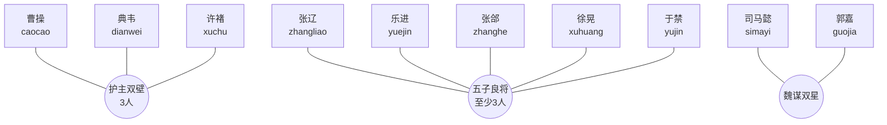

# 魏国武将羁绊关系图

全体魏国武将默认属于阵营羁绊“魏武中枢（2/5/8）”。夏侯渊、曹仁、夏侯惇、荀彧当前只有阵营羁绊，没有独立组合羁绊。

## 羁绊效果速查

| 羁绊 | 成员 | 当前效果 |
|---|---|---|
| 魏武中枢 | 任意2/5/8名魏将 | 全体魏将控制时长提高3%/8%/15%；8人时，所有魏将对带有眩晕、减速、灼烧或其他任意减益的目标伤害提高15%。 |
| 护主双壁 | 曹操、典韦、许褚 | 曹操受到超过8%最大生命的单次伤害时，护卫承担25%伤害并获得20%行动条。 |
| 五子良将 | 张辽、乐进、张郃、徐晃、于禁，至少3人 | 张辽参与控制接力；乐进获得额外裂箭；张郃建立受控集火；徐晃强化控制时长；于禁使被保护后军参与接力。 |
| 魏谋双星 | 司马懿、郭嘉 | 司马懿主动额外增加1道雷击；郭嘉控制持续时间提高45%。 |

## 仅有阵营羁绊的武将

夏侯渊（`xiahouyuan`）、曹仁（`caoren`）、夏侯惇（`xiahoudun`）、荀彧（`xunyu`）。
