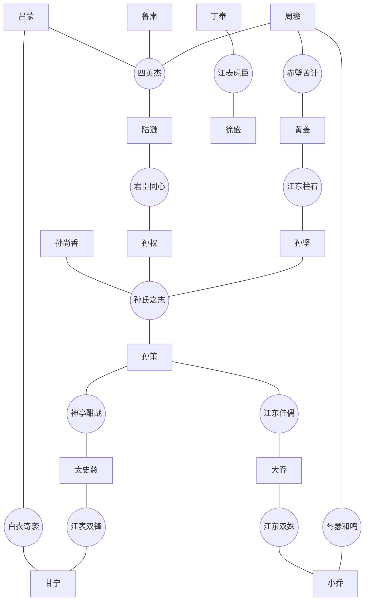

# 吴国武将羁绊关系图

吴国以“四英杰”和“孙氏之志”两组大型羁绊为核心，其他双人羁绊在两组核心成员之间形成技能强化网络。蒋钦已退出武将池，新增太史慈与丁奉。

## 羁绊效果速查

| 羁绊 | 成员 | 效果 |
|---|---|---|
| 江东联动 | 任意2/5/8名吴将 | 全体吴将最大生命提高2%/5%/8%；8人时，每场战斗首次有吴将即将阵亡，会按生命比例均摊全体存活吴将的生命，并各自恢复10%最大生命。 |
| 四英杰 | 周瑜、陆逊、鲁肃、吕蒙 | 周瑜额外点燃2格；陆逊火球总共弹射3次；吕蒙使目标恐惧4秒；鲁肃改为治疗两名最低当前生命友军，各恢复20%最大生命并使本场战斗最大生命提高350。 |
| 孙氏之志 | 孙坚、孙策、孙权、孙尚香 | 孙坚技能当前生命消耗由首次40%/后续10%提高至80%/20%，阵亡后使存活吴将本回合伤害+10%；孙策基础伤害由200%提高至400%，每损失10%生命获得4%减伤；孙权每次获得400+10%已损生命的最大生命（上限为初始值4倍），并恢复15%已损生命；孙尚香冷却改为6秒，每次连射2击150%伤害，施法后技能强度+2。 |
| 神亭酣战 | 孙策、太史慈 | 孙策追加第二段攻击正前方及右侧敌军，使正前方承受两次伤害；太史慈技能目标数由行动条最高的2人提高至3人。 |
| 江东佳偶 | 孙策、大乔 | 孙策施法后恢复12%最大生命；大乔治疗友军时，目标每损失10%生命，本次受到的治疗提高4%。 |
| 琴瑟和鸣 | 周瑜、小乔 | 周瑜灼烧由3秒延长至6秒；小乔减速目标由2名提高至3名，持续时间由6秒延长至8秒。 |
| 赤壁苦计 | 周瑜、黄盖 | 周瑜直接伤害和灼烧伤害按目标已损生命提高，每损失10%生命增伤5%；黄盖命中整列灼烧6秒，每秒造成实际消耗生命5%的伤害。 |
| 江东柱石 | 黄盖、孙坚 | 黄盖消耗15%最大生命并造成实际消耗生命45%的整列伤害；孙坚开局满行动条，伤害由实际消耗生命100%提高至150%。 |
| 江表双锋 | 太史慈、甘宁 | 太史慈对已灼烧目标直接伤害提高至300%技能强度；甘宁与左侧友军协击倍率提高至250%。 |
| 君臣同心 | 陆逊、孙权 | 陆逊火球伤害提高50%，对灼烧目标再提高50%；孙权造成的伤害由目标当前生命8%提高至12%，冷却由10秒缩短至8秒。 |
| 江表虎臣 | 丁奉、徐盛 | 丁奉追加横向攻击并压退行动条；徐盛控制持续时间+50%。 |
| 江东双姝 | 大乔、小乔 | 大乔治疗量+50%并追加治疗；小乔的行动条减速由35%提高至60%。 |
| 白衣奇袭 | 吕蒙、甘宁 | 吕蒙进入隐身后的下一次伤害提高60%；甘宁攻击生命低于50%的目标时伤害提高50%。 |
